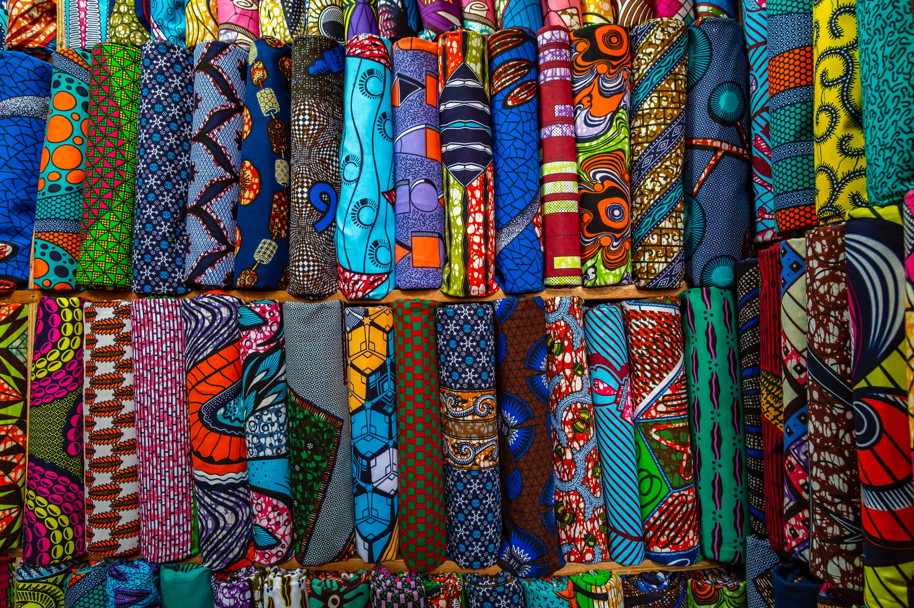
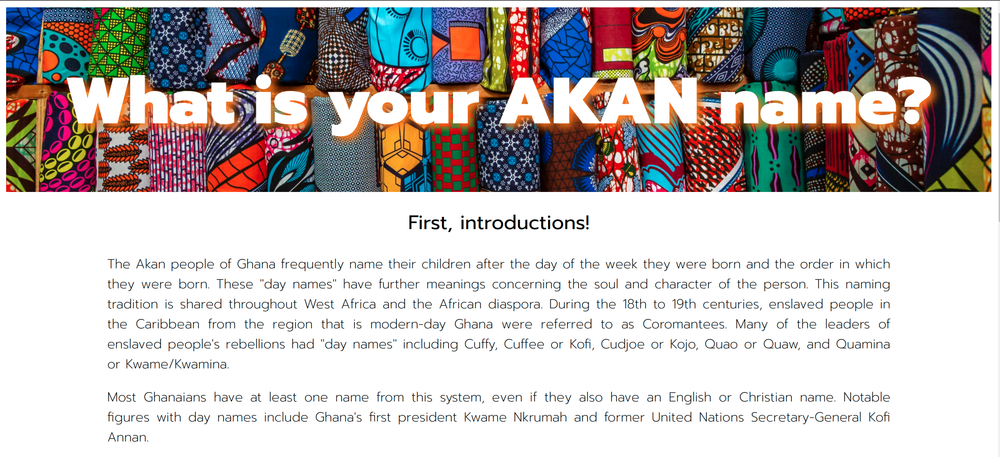
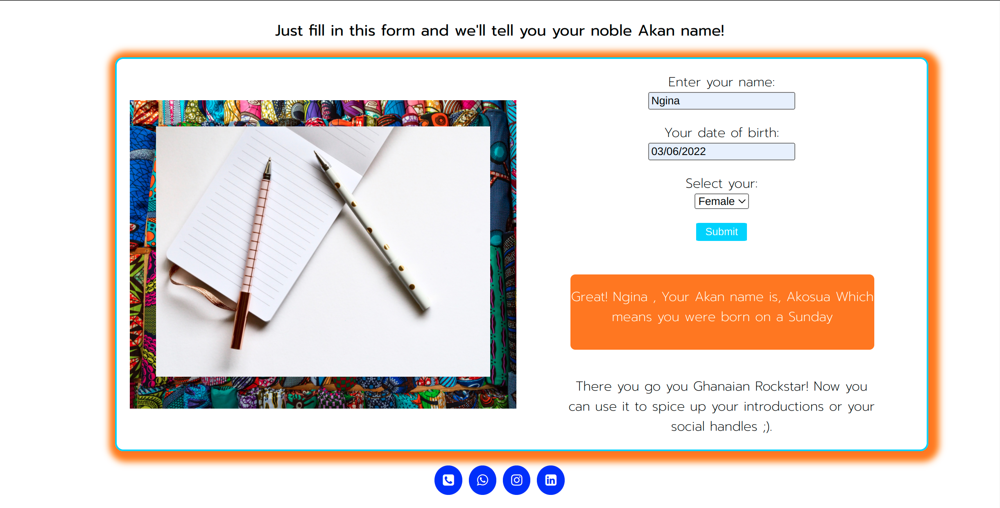

# Ngina-G.github.io
### Akan name Generator

A birth-date web-app that finds the date you were born and returns the date e.g. "Saturday", and then gives back an Akan name based on the Ghanaian namimg system. this project was created as a requirement for the Moringa Prep Module. 
 
### By Ngina Gitau @Ngina-G

 Input form

 

#### Check live demonstration <a href="https://ngina-g.github.io/"><strong>here</strong></a>
 
## Description
The Akan people of Ghana frequently name their children after the day of the week they were born and the order in which they were born. This app correlates the exact day and date the user was born with the Akan name factoring in their gender. 

### How To
Upon opening the page, the user is greeted with a brief introduction to the Akan culture and naming system on the <strong>Landing page</strong>.

Then the user scrolls down and enters their details in the <strong>input form</strong>.
Once the user has submitted their info, a prompt appears with a personalized message and their Akan name.

### Known bugs
~The landing page is not mobile responsive affecting the entire page.

~The date field prompts an error message although the user has followed the correct format.
But the bug is in the progress of being exterminated.

## Technologies Used
HTML, CSS and JAVASCRIPT.

### License
GNU AFFERO GENERAL PUBLIC LICENSE
Version 3, 19 November 2007

### Disclaimer
The user information is private and will not be collected for any purposes other than to return the function specified in the app.

### Contact Me
Visit my website here: https://www.nginagitau.com/
If you have any questions or comments, 
conatct me at Nginagitau11@outlook.com

### TO DO
Include other technologies, like Bootstrap and React

